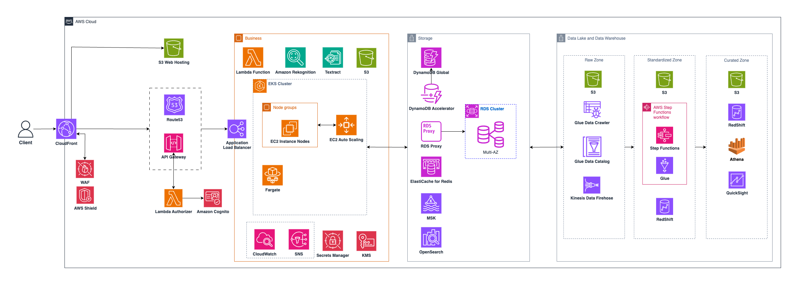

Provide your solution here:

## <b>Objective</b>
Architecture a highly available trading system with similar features to the Binance trading platform https://www.binance.com. This system will need to be resilient to failures, scalable, cost-effective and meet the required specifications mentioned in the challenge.

## <b>Resolution</b>

### Overview

 I've never used Binance before, so to be honest, I'm not very familiar with the platform. After some initial investigation on the basic functionalities that Binance provide to user, I decided to present 4 core features, 3 of them are client-facing features, whilst the last feature would not be directly supporting clients, but give better insights into how the business is runnung, which is really important for any kind of business. Here is the list of features that I will present:
 - User Authentication and KYC: This feature handles user registration, identity verification, and ongoing authentication for the trading platform. Users must complete Know Your Customer (KYC) verification by uploading government identification documents which are processed through AI services for text extraction and facial recognition.
 - Order Matching and Execution: This is the core trading engine that processes buy and sell orders from users, matches them based on price and time priority, and executes trades. The system maintains real-time order books, handles different order types (market, limit, stop orders), manages user account balances, and ensures all trades are recorded with full audit trails.
 - Price Feed: This feature provides live cryptocurrency price updates to users across web and mobile applications. It aggregates price data from multiple sources, calculates technical indicators like moving averages, and delivers real-time updates through WebSocket connections.
 - Data Reporting: This feature transforms raw trading data into business insights and powers intelligent features. It processes user trading patterns, market trends, and transaction histories to generate reports for business operations, regulatory compliance, and user analytics.

### User Authentication and KYC
#### Core Services:
- <b>Amazon Cognito:</b> Cognito is used as our primary authentication service. Amazon Cognito is built in with OAuth 2.0/SAML support. With Amazon Cognito, we can authenticate and authorize users from the built-in user directory, from enterprise directory, and from consumer identity providers like Google and Facebook.
- <b>Amazon S3:</b> S3 is used as the storage for uploading user documentation for KYC verification. S3 provides encryption at rest and lifecycle policies that help us meet regulatory compliance requirements for document retention. The cost of storing data in S3,plus with the use of lifecycle policy will help us to optimize cost for our system.
- <b>AWS Lambda:</b> We can create Lambda functions to process KYC and validation logic. Lambda's serverless architecture allows us to scale automatically based on document processing volume without managing infrastructure.
- <b>Amazon Textract:</b> Textract is used for extracting text of user identity from uploaded documents like government IDs, passport, etc.
- <b>Amazon Rekognition:</b> We utilize Amazon Rekognition for identity verification and face matching. This service compares faces in uploaded photos with government ID photos to ensure identity authenticity.
- <b>Amazon DynamoDB:</b> For this feature, we take advantage of DynamoDB's low latency and ability for robust scaling for storing user profiles, sessions, and also users' document metadata.

### Order Matching and Execution
#### Core Services:
- <b>Amazon EKS:</b> We build our core function as containerized application and host it onto our EKS cluster. EKS helps us to avoid the worry of managing the control plane and focus on our core applications, but still gives us more freedom on how to manage our workload (unlike ECS). We can also take advantage of AWS Managed Node Group for the autoscaling of nodes in the cluster to adapt with the surge of traffic to our workload. We can also run our EKS cluster on a mixed of EC2 instances and Farget instances for some cost optimization.
- <b>Amazon ElastiCache (Redis):</b>> ElastiCache with Redis provides sub-millisecond access to order books using Redis sorted sets. This in-memory data store is optimized for maintaining price-time priority in order matching algorithms.
- <b>Amazon MSK:</b> Amazon Managed Streaming for Apache Kafka serves as our event streaming platform. This managed service provides exactly-once delivery semantics essential for financial transactions and handles order events with high throughput.
- <b>Amazon RDS (PostgreSQL):</b> RDS with PostgreSQL handles transaction records and audit logs that require ACID compliance. This managed relational database ensures data consistency for financial transactions.
- <b>Application Load Balancer:</b> We would use Application Load Balancer to distribute traffic from API Gateway to our EKS cluster and act as an Ingress for our EKS cluster.

### Price Feed
#### Core Services:
- <b>Amazon Kinesis Data Streams:</b> Kinesis ingests real-time price data from multiple sources with sub-second latency. This service automatically scales based on throughput and provides replay capabilities for data recovery scenarios.
- <b>AWS Lambda:</b> Lambda functions aggregate and calculate derived price metrics like moving averages and technical indicators.
- <b>Amazon API Gateway WebSocket:</b> API Gateway manages real-time WebSocket connections for price updates to client applications.
- <b>Amazon CloudFront:</b> CloudFront distributes price feed page globally through edge locations reducing latency for international users. This CDN service caches frequently requested data closer to users worldwide.

### Data Reporting
#### Core Services:
- <b>Amazon Redshift:</b> Redshift serves as our analytical data warehouse optimized for financial reporting and compliance queries. This columnar storage database provides massively parallel processing for complex analytical workloads.
- <b>Amazon S3:</b> S3 acts as our central data lake storing raw market data, user activity logs, and processed analytics. The service provides storage tiering to automatically optimize storage costs based on access patterns.
- <b>AWS Glue:</b> Glue handles ETL operations with serverless, pay-per-use pricing and automatic schema discovery. This managed service transforms and prepares data for analytics without managing infrastructure. We can integrate our Glue jobs with Step Functions to orchestrate the data processing flow
- <b>Amazon QuickSight:</b> QuickSight provides business intelligence dashboards for trading analytics and operational metrics. This service offers per-session pricing that's cost-effective for varying user loads.
- <b>Amazon Athena:</b> Athena enables ad-hoc SQL queries against S3 data without managing infrastructure. This serverless service is perfect for exploratory data analysis and compliance reporting.

### Common Usage
Besides the AWS services used to specific features as mentioned above, we also put in use some other AWS services for common usage:
#### Security & Compliance
- <b>AWS WAF:</b> WAF provides web application firewall protection against common attacks like SQL injection and cross-site scripting. This service filters malicious traffic before it reaches the application layer.
- <b>AWS Shield Advanced:</b> Shield Advanced offers enhanced DDoS protection with 24/7 support and cost protection. This service provides additional safeguards for mission-critical financial applications.
- <b>AWS KMS:</b> KMS manages encryption keys with hardware security modules for data protection. This service provides centralized key management with detailed audit trails for compliance.
- <b>AWS Secrets Manager:</b> Secrets Manager handles secure storage and automatic rotation of database passwords and API keys. This service reduces security risks from hardcoded credentials in applications.
#### Monitoring & Operations
- <b>Amazon CloudWatch:</b> CloudWatch provides comprehensive metrics, logs, and monitoring across all AWS services. This service offers real-time visibility into application and infrastructure performance.
- <b>AWS SNS:</b> We can also create CloudWatch Alarm and send notification to SNS for alarming any incidents or issues on our system.

### Scaling Plane
As a global system like Binance, we will serve our applications to millions of user worldwide at a time. That's why we should take this into consideration when building our system. To do this, we can take several steps like below:
- <b>Multi Region Deployment:</b> We can use DynamoDB Global Tables, S3 replication, and Aurora Global Database. We can also use Amazon DynamoDB Accelerator (DAX) and RDS Proxy for improving read latency for eventually consistent or read-heavy workloads; shield the our database from connection surges and improve resilience to failover. We can also create multiple EKS cluster in each region, use Route53 route traffic to least latency region for processing the request.
- <b>Implement Caching:</b> Cache frequently accessed API responses where appropriate (with proper cache invalidation strategies) to reduce load on backend services.
